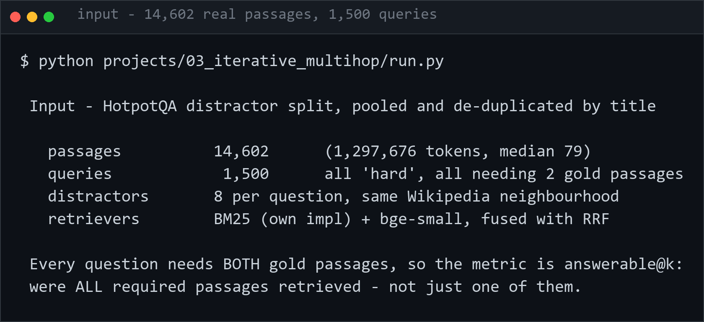
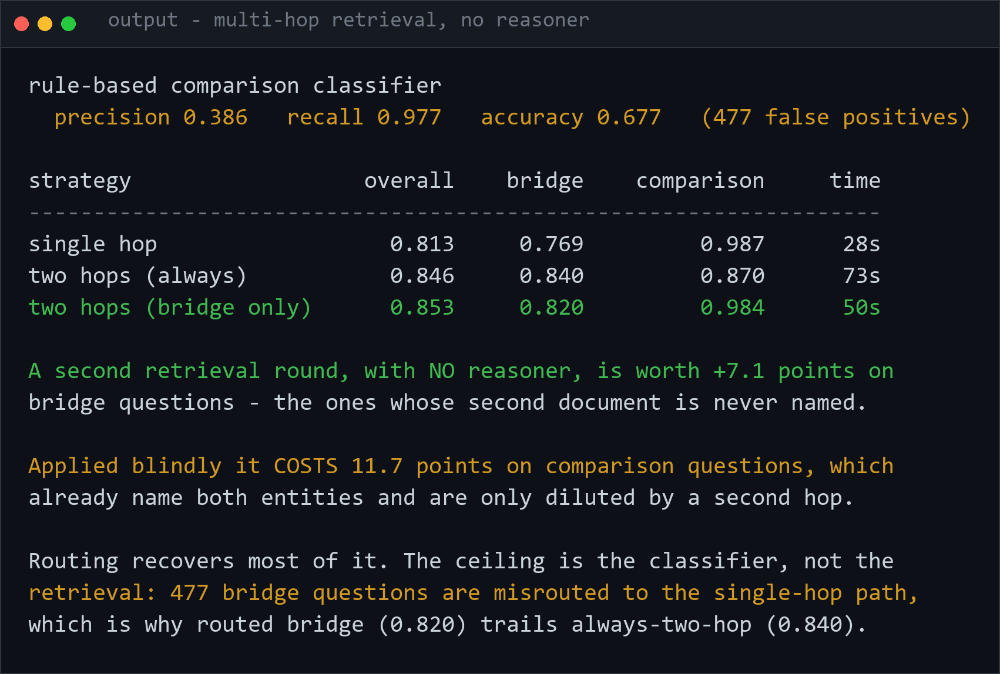

<h1 align="center">rag-lab</h1>
<p align="center"><i>RAG techniques measured as retrieval, on one real corpus, with no language model in the loop</i></p>

<p align="center">
  
  
  
  
</p>

---

> ### Retrieving smaller chunks made it worse. Multi-query fusion made it worse. A second retrieval round with no reasoner recovered most of what multi-hop agents are for.

Every RAG variant here is a **retrieval** technique, so it is measured as one. No
generation, no LLM-as-judge, no answer scoring — because putting a model at the
end of the pipeline adds its noise on top of the effect you are trying to see,
which is why published RAG comparisons disagree with each other so often.

## The corpus

HotpotQA's distractor split, pooled and de-duplicated by title.

| | |
|---|---:|
| passages | **14,602** |
| tokens | 1,297,676 |
| median passage | 79 tokens |
| queries | **1,500** |
| gold passages per query | **2** (all of them) |
| difficulty | all `hard` |

The distractors are the point. Each question ships with two paragraphs the
annotators actually used and eight plausible wrong ones drawn from the same
Wikipedia neighbourhood — so the wrong answers are about the same people and
places. A corpus where only the right passage mentions the topic measures
nothing.

## The metric that changes the conclusions

Every question needs **both** of its gold passages. So this lab reports
`answerable@k` — *were all required passages retrieved* — alongside recall.

```
BM25 @10 :  recall 81.3%   answerable 64.2%
```

Recall flatters it by **17 points**. A pipeline that retrieves one of two bridging
paragraphs cannot answer the question, however good its recall looks. Most RAG
benchmarks report the flattering number.

## Baselines

| Strategy | MRR | recall@10 | **answerable@10** | search time |
|---|---:|---:|---:|---:|
| BM25 (own implementation, no dependency) | 0.810 | 0.813 | 0.642 | 4.6s |
| Dense (`bge-small-en-v1.5`) | **0.928** | 0.891 | 0.792 | 23.4s |
| Hybrid, RRF fused | 0.891 | **0.905** | **0.813** | 28.7s |

⚠️ **This contradicts a finding in [nlp-lab](https://github.com/hammas159/nlp-lab)**, where
BM25 landed within 8 points of a pretrained embedding. Here dense beats it by
**15 points** on answerable@10. The difference is the queries: HotpotQA asks
paraphrased natural-language questions, not keyword lookups. Neither result is
wrong — which is the argument for measuring on your own corpus rather than
trusting a leaderboard.

---

## Input



## Output

`python projects/03_iterative_multihop/run.py`



---

## The projects

### [01 · What should a retrieval unit be?](projects/01_retrieval_unit/)

LongRAG says retrieve whole documents. Conventional wisdom says retrieve small
chunks for precision. Both cannot be right.

| granularity | units | mean tokens | hybrid answerable@10 |
|---|---:|---:|---:|
| title only | 14,602 | **3** | 0.415 |
| sentence | 59,784 | 25 | 0.775 |
| **paragraph** | 14,602 | 92 | **0.805** |

**Smaller is not sharper.** Sentence units cost **4× the index** and score 3 points
*worse* than paragraphs, on every retriever.

And the free one: **prepending the passage title to its text is worth +4.0 points**
of answerable@10 for BM25 (0.642 → 0.682) at zero cost. Title-only retrieval —
three tokens, no body text at all — already answers **41.5%** of these multi-hop
questions, which is why the prefix matters so much.

### [02 · RAG-Fusion without a language model](projects/02_rag_fusion/)

RAG-Fusion retrieves on several LLM-written rewrites and fuses with RRF. That
conflates two things: does the *fusion* help, or the *paraphrase*? Here the
rewrites are rule-based, so fusion is measured alone.

| views fused | answerable@10 | queries/question | time |
|---|---:|---:|---:|
| **original only** | **0.813** | 1.00 | 28s |
| + keywords | 0.807 | 2.00 | 57s |
| + split clauses | 0.784 | 1.75 | 47s |
| + keywords + entities | 0.764 | 2.97 | 78s |
| all five views | 0.762 | 3.80 | 102s |

**Every variant loses, monotonically.** More views, worse results — 3.6× the cost
to give up 5 points. RRF weights each ranking equally, so a degraded query
dilutes a good one rather than complementing it.

The falsifiable claim this leaves: *if RAG-Fusion helps, the LLM's paraphrase is
doing the work, not the fusion.*

### [03 · Multi-hop retrieval without a reasoner](projects/03_iterative_multihop/)

A bridge question hides its second document behind the first. The usual fix is an
agent that reads hop one and writes a query for hop two. Here round two's query
is simply the question plus vocabulary from round one — no model reasons about
what is missing.

| strategy | overall | bridge | comparison | time |
|---|---:|---:|---:|---:|
| single hop | 0.813 | 0.769 | **0.987** | 28s |
| two hops, always | 0.846 | **0.840** | 0.870 | 73s |
| **two hops, bridge only** | **0.853** | 0.820 | 0.984 | 50s |

**+7.1 points on bridge questions with no LLM.** But blind application *costs*
**11.7 points** on comparison questions, which already name both entities and are
only harmed by a second hop.

Routing fixes most of that — and is capped by the router. The rule-based
bridge/comparison classifier is reported before it is used:

```
precision 0.386   recall 0.977   accuracy 0.677
```

It catches almost every comparison (97.7%) but fires on 477 bridge questions it
shouldn't, which is exactly why routed bridge accuracy (0.820) trails
always-two-hop (0.840). **The ceiling here is classifier precision, not
retrieval.**

---

## What this all says

Three techniques, three honest outcomes: one helps a lot in a narrow place
(iterative retrieval, on bridge questions), one is free and nobody mentions it
(title prefixes), and one does not work at all in isolation (multi-query fusion).

None of them needed a language model to measure.

## Running it

```bash
python projects/01_retrieval_unit/run.py
python projects/02_rag_fusion/run.py
python projects/03_iterative_multihop/run.py
```

The corpus is sampled with a fixed seed and cached to disk, so every project
measures against byte-identical data. A variant that looked better on a different
sample would not be a finding.

## Layout

```
shared/corpus.py      HotpotQA -> de-duplicated passages + gold labels, cached
shared/retrieval.py   BM25 (own, inverted index), dense, RRF, cross-encoder
shared/metrics.py     recall@k, answerable@k, nDCG@k, MRR
shared/pipeline.py    the baselines every variant is measured against
projects/             one directory per technique, each writing results.json
```

## Stack

`Python 3.11+` · `sentence-transformers` (`bge-small-en-v1.5`,
`ms-marco-MiniLM-L-6-v2`) · `datasets` · `numpy` · `pytest` — **BM25 is
implemented here**, not imported.

## Not yet measured

HyDE, Self-RAG, Corrective RAG, Adaptive RAG, FLARE, RAPTOR, GraphRAG and
Speculative RAG. The first is the only one in that list that genuinely requires a
generator; the rest can be approximated without one, which is the next thing to
find out.

## Licence

MIT — see [LICENSE](LICENSE).
